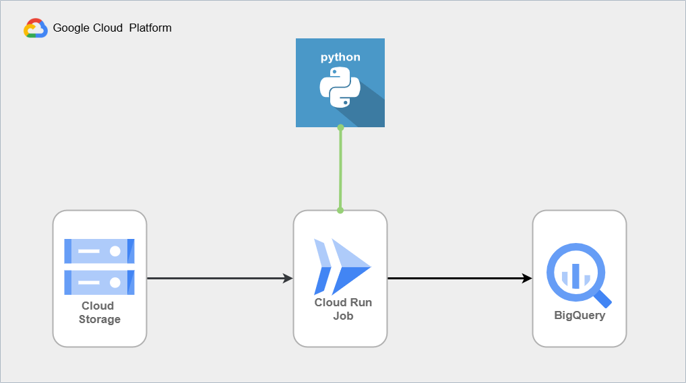

# Pipeline de Transcrição de Áudio com Gemini

Este repositório contém o código-fonte de um pipeline automatizado e escalável para transcrição de arquivos de áudio utilizando o poder dos modelos de IA Generativa do Google (Gemini) na Google Cloud Platform (GCP).

## Introdução

A solução foi desenhada para processar grandes volumes de arquivos de áudio armazenados no Google Cloud Storage (GCS). Ela automatiza o fluxo de ponta a ponta: desde a leitura do arquivo bruto, passando pela extração de metadados e transcrição via LLM, até a persistência dos dados estruturados no BigQuery para análise posterior.

O sistema é construído em Python e conteinerizado com Docker, projetado para ser executado como um **Cloud Run Job**, permitindo processamento paralelo e eficiente.

Um dos principais benefícios desta arquitetura é que os dados finais no BigQuery estão prontos para análise imediata. A tabela resultante, contendo colunas como a duração do áudio, o texto completo da transcrição e o JSON estruturado, pode ser conectada diretamente como fonte de dados no **Looker Studio**.

## Objetivo

O principal objetivo deste projeto é transformar dados não estruturados (áudio) em dados estruturados e acionáveis. Ele visa:

1.  Eliminar a necessidade de transcrição manual.
2.  Extrair não apenas o texto falado, mas também metadados técnicos (como duração) e estruturais do áudio.
3.  Centralizar as informações em um data warehouse analítico (BigQuery) de forma automática e confiável.

## Arquitetura da Solução

A arquitetura é baseada em eventos e processamento em lote (batch), utilizando serviços gerenciados do Google Cloud para garantir escalabilidade e baixa manutenção.

<div align="center">
  
</div>
<br>

**Fluxo de Dados Simplificado:**
1.  **Input:** Arquivos de áudio são depositados em um bucket no Google Cloud Storage (o código atual está configurado para processar arquivos **.ogg**, mas a lógica pode ser adaptada para outros formatos suportados pelo Gemini, como MP3 e WAV). 
2.  **Processamento:** Um Cloud Run Job é disparado. Múltiplas instâncias (tasks) do container Python são iniciadas em paralelo.
3.  **Orquestração:** Cada task lista os arquivos do bucket e seleciona apenas a fatia de arquivos que lhe compete processar (distribuição de carga).
4.  **IA Generativa:** O container envia a URI do áudio diretamente para o modelo Gemini (via SDK `google-genai`), que retorna a transcrição e metadados em formato JSON estruturado.
5.  **Output:** Os dados processados são formatados e inseridos via streaming em uma tabela do BigQuery.

**Schema de Tabela do BigQuery:**

Segue o exemplo de schema utilizado na criação da tabela no BigQuery, para armazenamento da transcrição:

```sql
CREATE TABLE `project_name.dataset_name.table_name` (
  id STRING DEFAULT GENERATE_UUID(),
  data_transcricao TIMESTAMP DEFAULT CURRENT_TIMESTAMP(),
  uri_audio STRING NOT NULL,
  duracao_audio FLOAT64,
  transcricao_textual STRING,
  transcricao_metadados JSON
);
```

## Como Funciona (Explicação de Código)

### Orquestração (`main.py`)
O ponto de entrada da aplicação. Ele é responsável por:
1.  Listar todos os objetos no bucket GCS configurado.
2.  Implementar a lógica de distribuição de trabalho para Cloud Run Jobs. Utilizando as variáveis de ambiente `CLOUD_RUN_TASK_INDEX` (índice da instância atual) e `CLOUD_RUN_TASK_COUNT` (total de instâncias), ele usa aritmética modular (`i % COUNT == INDEX`) para garantir que cada arquivo seja processado por apenas uma instância, sem duplicação.
3.  Chamar as camadas de serviço para cada arquivo selecionado.

### Integração com IA (`llm/gemini.py`)
Este módulo encapsula a comunicação com o modelo Gemini. Ele envia a URI do GCS (`gs://...`) e um prompt instruindo o modelo a retornar a transcrição e a duração em um formato JSON estrito. Inclui tratamento para limpar possíveis formatações Markdown que a IA possa adicionar.

### Persistência (`services/bigquery_data.py`)
Responsável por salvar os resultados. Ele recebe o JSON bruto e o texto formatado. Um ponto crucial aqui é a preparação do payload para o BigQuery: campos estruturados (como `duracao_audio`) são enviados nativamente, enquanto o objeto JSON complexo com os metadados da transcrição é convertido para string (`json.dumps`) para ser armazenado corretamente em uma coluna do tipo `JSON` no BigQuery.

## Tecnologias Utilizadas

Para executar ou desenvolver este projeto, são necessárias as seguintes ferramentas e configurações:

### Tecnologias
* **Linguagem:** Python 3.11+
* **Containerização:** Docker
* **Nuvem:** Google Cloud Platform (GCP)
    * Cloud Storage (GCS)
    * Cloud Run Jobs
    * BigQuery
    * Vertex AI (Modelo Gemini)

### Principais Bibliotecas Python
As dependências do projeto estão listadas no arquivo `requirements.txt`:
* `google-genai`: SDK moderno para interagir com os modelos Gemini.
* `google-cloud-storage` & `google-cloud-bigquery`: Clientes para interação com os serviços de armazenamento e dados da GCP.
* `python-dotenv`: Para gerenciamento seguro de variáveis de ambiente locais.
* `json-repair`: Para garantir a robustez na análise das respostas JSON da IA.

### Arquivos Necessários
* **`.env`**: Arquivo na raiz do projeto contendo as variáveis de ambiente sensíveis (não versionado no Git). Exemplo:
    ```env
    PROJECT_ID=seu-projeto-id
    BUCKET_NAME_GCS=nome-do-seu-bucket-audios
    AUDIO_FOLDER_GCS=pasta/onde/estao/audios/
    BIGQUERY_DATASET=seu_dataset
    BIGQUERY_TABLE=sua_tabela_transcricoes
    # CLOUD_RUN_TASK_INDEX e TASK_COUNT são injetados automaticamente pelo Cloud Run
    ```

* **`deploy_job.sh`**: Arquivo responsável por realizar o deploy da aplicação no **Cloud Run Jobs**. Após preencher o .env com os dados necessários, basta executar esse arquivo.


